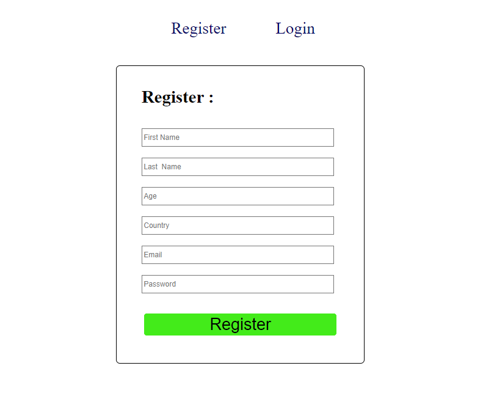
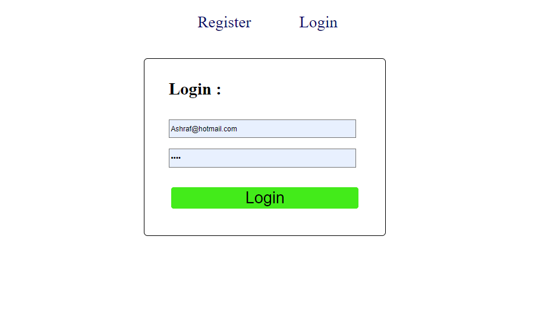
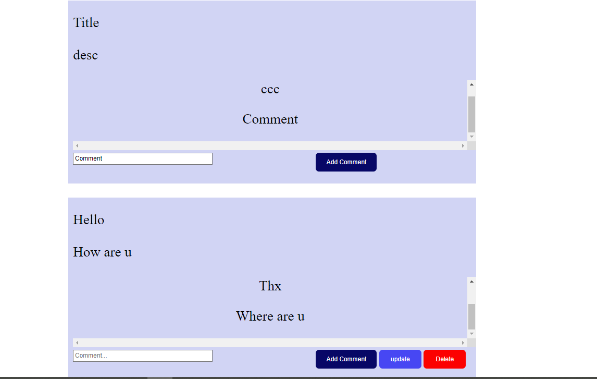
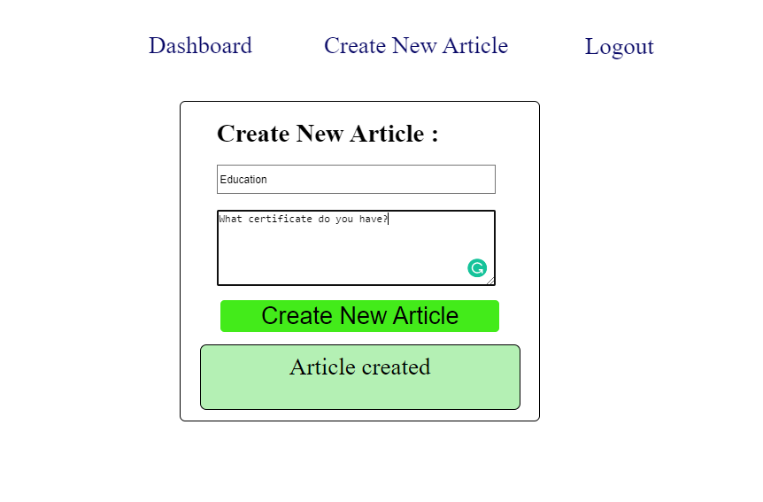

<p align="center">
  <a href="" rel="noopener">

</p>

<h3 align="center">The Articles</h3>

---

<p align="center">A mini project consisting of publishing and commenting on articles
          The admin can modify and delete it. 
    <br> 
<a href=''>Demo</a>
    <br> 
</p>

## 📝 Table of Contents

- [About](#about)
- [Getting Started](#getting_started)
- [Usage](#usage)
- [Built Using](#built_using)
- [User Story](#user_story)
- [Data Flow](#data_flow)
- [Guided By](#guided_by)

## - About <a name = "about"></a>

The project is to publish articles from users that can be commented on by other users and allow the user to edit and delete articles that they have published


## - Getting Started <a name = "getting_started"></a>

These instructions will get you a copy of the project up and running on your local machine for development and testing purposes.

### Prerequisites

- Visual Studio Code follow this <a href='https://code.visualstudio.com/download'>link</a> to install.
- Git Bash follow this <a href='https://git-scm.com/downloads'>link</a> to install.
- MongoDB follow this <a href='https://www.mongodb.com/try/download/community2'>link</a> to install.
- Node.js follow this <a href='https://nodejs.org/en/download/'>link</a> to install.
- Postman follow this <a href='https://www.postman.com/downloads/'>link</a> to install.

### Installing:

1. Clone the repo to your local machine using git bash.

```
git clone https://github.com/your_username_/Project-Name.git
```

2. Install packeges repeat this step in backend and frontend folder

```
npm install
```

3. Run server using git bash inside backend folder

```
npm run dev
```

4. Run application using git bash inside frontend folder

```
npm run start
```

### Now app ready to use  

<br>


## - Usage <a name="usage"></a>


- You have to **register** and **Login** to Good Food




- page DashBord contains all articles You can click on the **Add Comment** to add comment and If you are the publisher of the article, you can **edit** and **delete** it



- You can Add Articles to appear on the dashboard page



## ⛏️ Built Using <a name = "built_using"></a>

- [MongoDB](https://www.mongodb.com/) - Database
- [Express JS](https://expressjs.com/) - Server Framework
- [React JS](https://https://reactjs.org/) - Web Framework
- [Node JS](https://nodejs.org/en/) - Server Environment

<br>

<br>


## ⚠️ Guided By <a name = "guided_by"></a>

This project is guided by ©️ **[MERAKI Academy](https://www.meraki-academy.org)** && **[Ashraf Alalaqmeh](https://ashrafalalaqmeh.vercel.app/#)**
